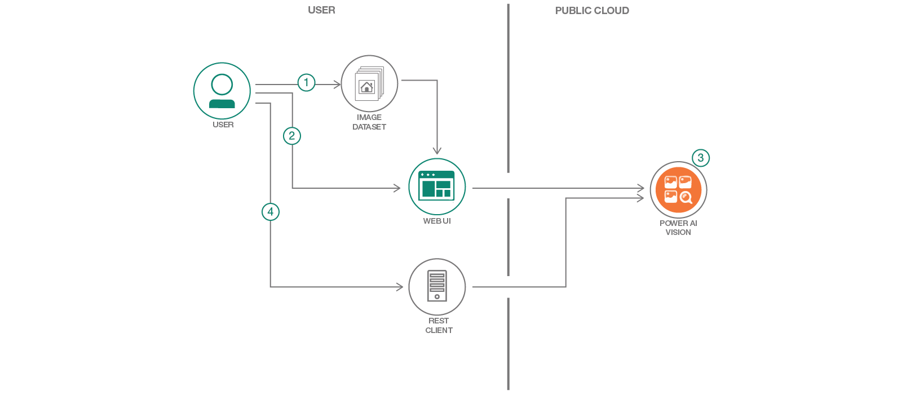
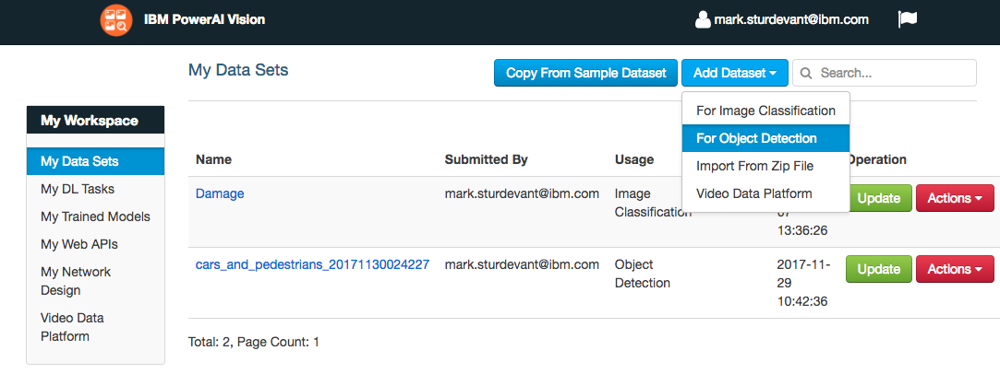
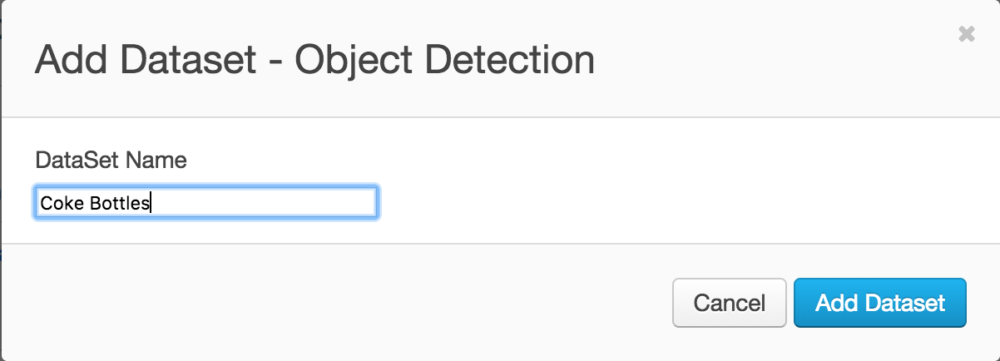
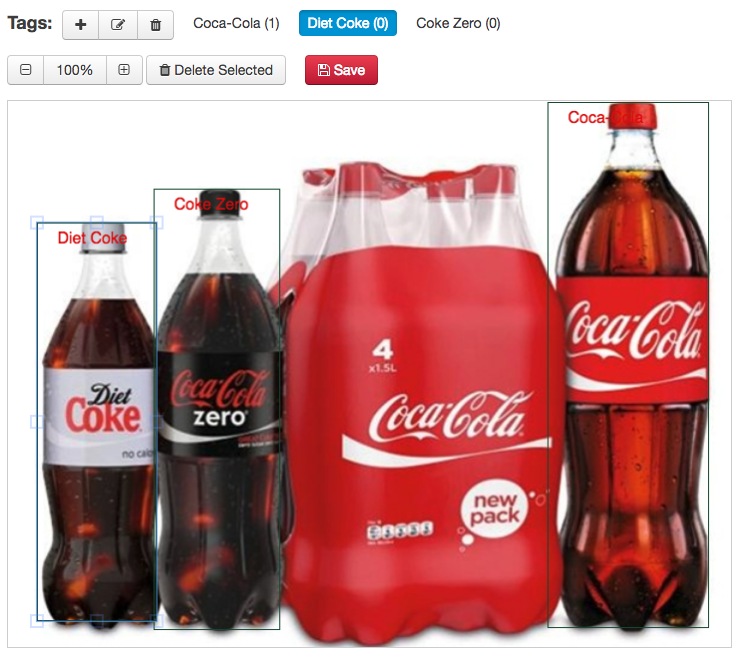
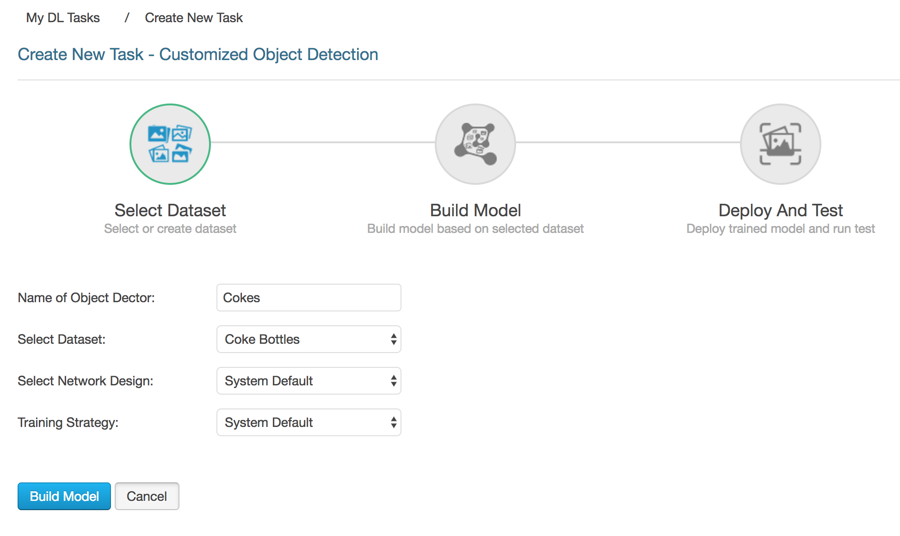
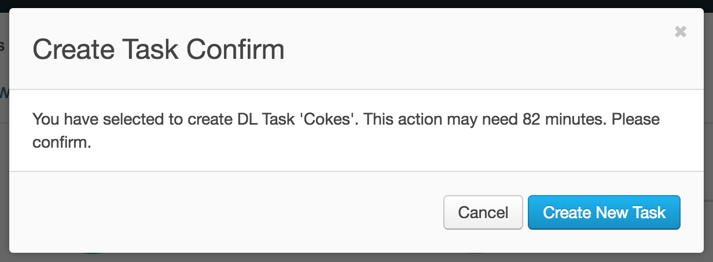
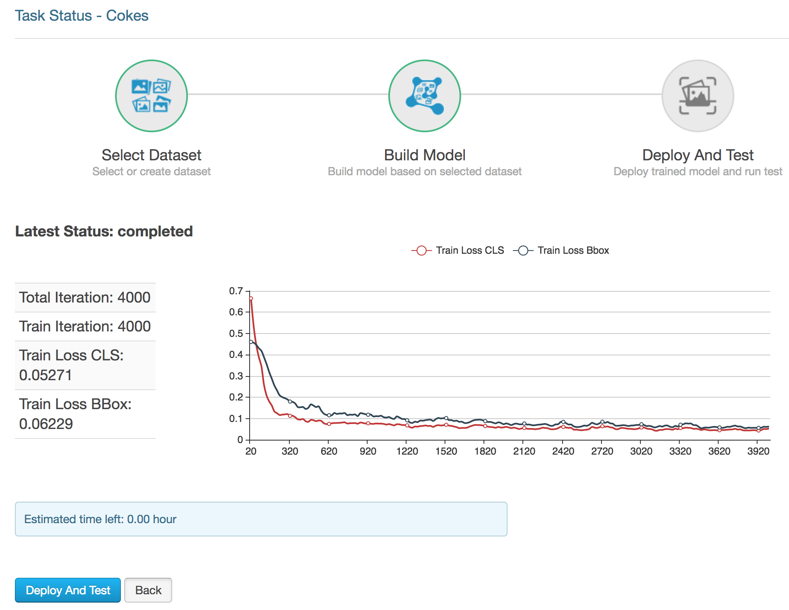

# Object detection with PowerAI Vision

In this Code Pattern, we will use PowerAI Vision Object Detection
to detect and label objects, within an image, based on customized
training.

> This example can easily be customized with your own datasets.

A example dataset has been provided with images of Coca-Cola bottles.
Once we train and deploy a model, we'll have a REST endpoint
that allows us locate and count Coke bottles in an image.

Deep learning training will be used to create a model for
Object Detection. With PowerAI Vision, deep learning training is
as easy as a few clicks of a mouse. Once the task has completed,
the model can be deployed with another click.

PowerAI Vision presents REST APIs for inference operations.
Object detection with your custom model can be used from any REST
client and can also be tested in the PowerAI Vision UI.

When the reader has completed this Code Pattern, they will understand how to:

* Create a dataset for object detection with PowerAI Vision
* Train and deploy a model based on the dataset
* Test the model via REST calls



## Flow
1. User uploads images to create a PowerAI Vision dataset
1. User labels objects in the image dataset prior to training
1. The model is trained, deployed and tested in PowerAI Vision
1. User can detect objects in images using a REST client

## Included components
* [IBM Power Systems](https://www-03.ibm.com/systems/power/): A server built with open technologies and designed for mission-critical applications.
* [IBM PowerAI](https://www.ibm.com/ms-en/marketplace/deep-learning-platform): A software platform that makes deep learning, machine learning, and AI more accessible and better performing.
* [IBM PowerAI Vision Technology Preview](https://developer.ibm.com/linuxonpower/deep-learning-powerai/technology-previews/powerai-vision/): A complete ecosystem for labeling datasets, training, and deploying deep learning models for computer vision.

## Featured technologies
* [Artificial Intelligence](https://medium.com/ibm-data-science-experience): Artificial intelligence can be applied to disparate solution spaces to deliver disruptive technologies.

<!-- TODO: Depending on what demo app...
* [Mobile](https://mobilefirstplatform.ibmcloud.com/): Systems of engagement are increasingly using mobile technology as the platform for delivery.
* [Node.js](https://nodejs.org/): An open-source JavaScript run-time environment for executing server-side JavaScript code.
* [Python](https://www.python.org/): Python is a programming language that lets you work more quickly and integrate your systems more effectively.
-->

<!--Update this section when the video is created-->
<!-- TODO:
# Watch the Video
[](https://www.youtube.com/watch?v=Jxi7U7VOMYg)
-->

# Prerequisites

*This Code Pattern was built with the PowerAI Vision Technology Preview v3.0.*

Go to [Try Power AI](https://developer.ibm.com/linuxonpower/deep-learning-powerai/try-powerai/) 
and use `On Premise` to download an installer to deploy the preview on
your Power Systems, or use `SuperVessel` and register for access to the
SuperVessel cloud where you can try the preview.


<!-- TODO: how to adapt to on premise? -->
> NOTE: The steps and examples in this README assume you are using SuperVessel.

# Steps

<!-- TODO: Update the repo and tracking id -->
<!-- TODO: Will be used if we have an example app to deploy -->
<!--
Use the ``Deploy to IBM Cloud`` button **OR** run locally.

## Deploy to IBM Cloud
[](https://bluemix.net/deploy?repository=https://github.com/IBM/powerai-vehicle-damage-analyzer)


1. Press the above ``Deploy to IBM Cloud`` button and then click on ``Deploy``.

2. In Toolchains, click on Delivery Pipeline to watch while the app is deployed. Once deployed, the app can be viewed by clicking 'View app'.

3. Use the IBM Cloud dashboard to manage the app. The app is named `powerai-vehicle-damage-analyzer` with a unique suffix.
-->

## Run locally

<!--
> NOTE: These steps are only needed when running locally instead of using the ``Deploy to IBM Cloud`` button.
-->

1. [Clone the repo](#1-clone-the-repo)
2. [Login to PowerAI Vision](#2-login-to-powerai-vision)
3. [Create a dataset](#3-create-a-dataset)
4. [Create tags and label objects](#4-create-tags-and-label-objects)
5. [Create a DL task](#5-create-a-dl-task)
6. [Deploy and test](#6-deploy-and-test)

### 1. Clone the repo

Clone the `powerai-vision-object-detection` locally. In a terminal, run:

```
git clone https://github.com/IBM/powerai-vision-object-detection
```

### 2. Login to PowerAI Vision

If you are using SuperVessel, login here: https://ny1.ptopenlab.com/AIVision/index.html

### 3. Create a dataset

PowerAI Vision Object Detection discovers and labels objects within an image, enabling users and developers to count instances of objects within an image based on customized training.

To create a new dataset for object detection training:

1. From the `My Data Sets` view, click the `Add Dataset` button and then select `For Object Detection` in the pull-down.


1. Provide a DataSet Name and click `Add Dataset`.


1. Upload one or more images using drag-and-drop or `Select some`. You can use `powerai-vision-object-detection/data/coke_bottles.zip` from your cloned repo to upload many at once.


> Note: If you are using your own zip file and do not see file thumbnails after the upload, then the upload failed. Use lowercase file names without special characters or spaces. You can also upload individual files or multi-select several at a time to determine which file caused the upload to fail.

<!-- TODO: set1, set2 (for better results...), testset -->

### 4. Create tags and label objects

1. Create one or more tags by clicking the `+` icon to add a new tag. Each tag will represent the training objects within the image based on specific use cases (e.g., "Coca-Cola", "Diet Coke", "Coke Zero").

1. Label the objects in each image by selecting a tag and dragging a bounding box around the object in the image. Press `Save` when done with each image.

1. Repeat this process for all tags and all images.

    > Tip: Use the `Only Show Unlabeled Files` pull-down to help you see when you are done.

1. Click `Export As Zip File` to save a copy of your work. Now that you've spent some time labeling, this zip will let you start over without losing your work.

### 5. Create a DL task

1. Click on `My DL Tasks` under My Workspace and then click the `Create New Task` button. Click on `Object Detection`.

1. Give the Object Detector a name and make sure your dataset is selected, then click `Build Model`.


1. A confirmation dialog will give you a time estimate.  Click `Create New Task` to get it started.


### 6. Deploy and test

When the model is built, click on `Deploy and Test`.




<!-- TODO: upload as labelled zip -->

<!-- TODO: add this w/ new tracker when/if we have a tracked app
# Privacy Notice
If using the `Deploy to IBM Cloud` button some metrics are tracked, the following
information is sent to a [Deployment Tracker](https://github.com/IBM/cf-deployment-tracker-service) service
on each deployment:

* Node.js package version
* Node.js repository URL
* Application Name (`application_name`)
* Application GUID (`application_id`)
* Application instance index number (`instance_index`)
* Space ID (`space_id`)
* Application Version (`application_version`)
* Application URIs (`application_uris`)
* Labels of bound services
* Number of instances for each bound service and associated plan information

This data is collected from the `package.json` file in the sample application and the `VCAP_APPLICATION` and `VCAP_SERVICES` environment variables in IBM Cloud and other Cloud Foundry platforms. This data is used by IBM to track metrics around deployments of sample applications to IBM Cloud to measure the usefulness of our examples, so that we can continuously improve the content we offer to you. Only deployments of sample applications that include code to ping the Deployment Tracker service will be tracked.

## Disabling Deployment Tracking
To disable tracking, simply remove ``require("cf-deployment-tracker-client").track();`` from the ``app.js`` file in the top level directory.
-->

<!--
# Links
* [Demo on Youtube](https://www.youtube.com/watch?v=XXXXXXXXXXX)
 -->

# Learn more
* **Artificial Intelligence Code Patterns**: Enjoyed this Code Pattern? Check out our other [AI Code Patterns](https://developer.ibm.com/code/technologies/artificial-intelligence/).
* **AI and Data Code Pattern Playlist**: Bookmark our [playlist](https://www.youtube.com/playlist?list=PLzUbsvIyrNfknNewObx5N7uGZ5FKH0Fde) with all of our Code Pattern videos
* **PowerAI**: Get started or get scaling, faster, with a software distribution for machine learning running on the Enterprise Platform for AI: [IBM Power Systems](https://www.ibm.com/ms-en/marketplace/deep-learning-platform)

# License
[Apache 2.0](LICENSE)
